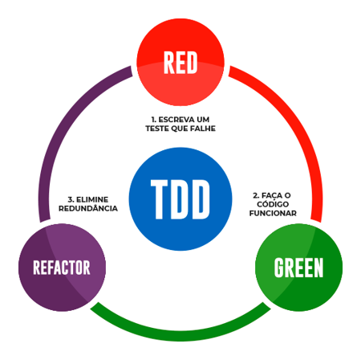

# Testes Unitários com JUnit

<div style="text-align: center">
    <h2>Habilidades desenvolvidas neste curso</h2>
</div>
<div style="text-align: center;">
    
    
    
    
</div>

## Testes unitários, qual a importância?
O desenvolvimento de softwares é uma atividade nada simples. Além de envolver o trabalho de diversos profissionais,
a preocupação com o desempenho e com o bom funcionamento do produto final exige ações efetivas ao longo da criação.
E, como já diz uma velha máxima da programação: a qualidade de um software não pode ser avaliada em um produto depois de pronto.
Então, por que não adotar técnicas que vão aprimorar a produção já em seu desenvolvimento?

Com os testes unitários, isso é possível. O método de *Test-Driven Development (TDD)*
– “Desenvolvimento Dirigido por Testes”, permite fazer avaliações onde os desenvolvedores identifiquem as falhas
no fluxo de informação do produto que está sendo criado para, dessa forma, reparar os erros básicos que podem interferir
na qualidade do resultado final.
<div style="text-align: center">Test-Driven Development
    
</div>

A norma ISO 9126 (2001), define os fatores para que um software tenha um nível de qualidade adequado.
+ **Correção:** implica a capacidade de o software realizar as tarefas de forma precisa, ou seja,
de acordo com os requisitos especificados pelo cliente.
+ **Extensibilidade:** é a forma como se podem inserir modificações no software; ou seja,
ele deve ser flexível o suficiente para que modificações sejam realizadas de forma fácil.
+ **Reusabilidade:** é a facilidade com que os softwares podem ser reutilizados totalmente ou
em partes para novas aplicações. Isso faz com que haja economia e níveis de qualidade satisfatórios
durante a produção de novos softwares, pois ocorrerá menor esforço na escrita e menor risco de erros.
+ **Robustez (confiabilidade):** essa capacidade mostra que o software funciona mesmo em condições
não validadas nas especificações dos requisitos.
+ **Compatibilidade:** refere-se à facilidade de combinar softwares com
outros componentes. Ou seja, ao ser utilizado, o software deve funcionar plenamente sem interferir em outras aplicações.
Dessa forma, não deve haver problemas devido à execução de dois ou mais tipos de softwares ao mesmo tempo.
Como exemplo, considere a estrutura de dados padronizada, as interfaces homem-máquina padronizadas ou ainda a
padronização de formatos de arquivos.
+ **Portabilidade:** é a facilidade com que um software pode ser transposto de um ambiente para outro,
de acordo com os subatributos: adaptabilidade, facilidade de instalação, conformidade e facilidade de substituição
(PRESSMAN; MAXIM, 2016). É um dos fatores difíceis de se obter, pois nem sempre é possível alinhar o software às
diferentes plataformas, sistemas operacionais e periféricos.
+ **Eficiência:** esse fator está diretamente relacionado à utilização racional dos recursos de hardware e do sistema
operacional em que o software será instalado. Entre esses recursos, estão: memória, recursos gráficos, bibliotecas, entre outros.

## Por que fazer testes unitários?
A adoção de testes unitários na produção de software, permite solucionar dois problemas bem recorrentes que
prejudicam o seu bom desempenho. Eles são:
+ **Alta taxa de defeitos:** resultado de erros frequentes no funcionamento, este índice faz com que, muitas vezes,
+ o software deixe de ser utilizado.
+ **Deterioração do sistema:** quando executado, o produto pode até ter um bom desempenho. Entretanto, ao longo do tempo,
+ ele pode apresentar complicações que exigem a substituição de todo o sistema.

Dessa forma, a realização de pequenas avaliações pode identificar e resolver as principais causas para os obstáculos
de um bom desempenho. No primeiro caso, os testes unitários aumentam a validação de todas as funções do programa final,
o que diminui a probabilidade de erros futuros. E, no segundo, eles permitem a simplificação dos códigos utilizados,
fazendo com que elementos desnecessários fiquem de fora e não resultem no mau funcionamento de todo o sistema.

## Dicas para escrever bons Testes Unitários

### Fazer testes pequenos
Como nos testes unitários testamos pequenas unidades de código então criar testes pequenos é um bom caminho.
Então no geral um bom teste unitário não deve ser grande.

~~~test
    @Test
    void validarDadosDeRetorno() {
        Assertions.assertTrue(true);
    }
~~~

### Fazer testes rápidos
Os testes unitários são os mais rápidos. E os testes precisam ser rápidos, já que eles devem ser executados o tempo todo. 
Para isso mock todo o tipo de dependência externa. Isso se aplica a bancos de dados por exemplo.

~~~test  
    @Test
    void validarNumerosDeTiposDiferentes() {

        double valor = 5.0;
        double outroValor = 5.0;

        assertEquals(valor, outroValor);
    }
~~~

### Fazer testes determinísticos
De nada adianta criar testes unitários onde não dá pra garantir o seu resultado. Então sempre faça testes determinísticos.
Só assim será possível ter segurança no código. E isso vai evitar que um teste passe em um momento e não passe em outro,
com a mesma entrada.

~~~test
@Test
    void validarValoresDeOperacoes() {

        /* Validando soma */
        int resultado = 10;
        assertEquals(resultado, (5 + 5));

        /* Validando igualdade de valores */
        double valor = 5.0;
        double outroValor = 5.0;
        assertEquals(valor, outroValor);
    }
~~~

### Colocar nomes descritivos
Da mesma forma que é importante nomear bem funções é também importante nomear bem os testes.
Isso deixa os testes mais simples de entender e manter.

~~~test
@Test
    void validarSeArraysSaoIguais() {

        /* Valida se os arrays são iguais, comparando um a um */
        int[] primeiroLancamento = {10, 20, 30, 40, 50};
        int[] segundoLancamento = {10, 20, 30, 40, 50};
        assertArrayEquals(primeiroLancamento, segundoLancamento);

        /* Utilizando arrays de diferentes tipos, começando por boolean[] */
        boolean[] flags = {true, false, false};
        assertArrayEquals(new boolean[]{true, false, false}, flags);

        /* Utilizando arrays de diferentes tipos, começando por double[] */
        double[] valores = {5.0, 10.5, 50D, 46d};
        assertArrayEquals(new double[]{5.0, 10.5, 50D, 46d}, valores);
    }
~~~

### Apenas uma asserção por teste
O teste unitário deve testar só uma unidade de código, então não faz sentido ter mais de uma asserção por teste.
Mas isso não quer dizer que você não pode ter um teste com mais de um caso de testes. Isso sim é possível e ajuda
muito a não duplicar código.

```test
    @DisplayName("Teste que valida se o usuário foi criado")
    @Test
    void validaFluxoA() {
        Assertions.assertTrue(true);
    }
```

## Referências
https://imasters.com.br/devsecops/testes-unitarios-qual-a-importancia
https://devporai.com.br/5-dicas-para-escrever-bons-testes-unitarios/